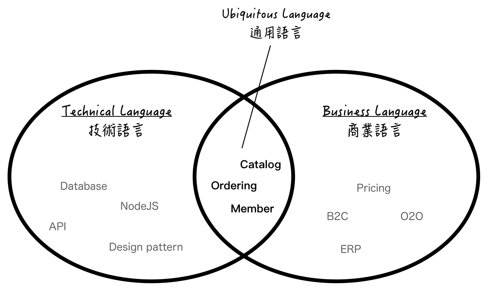
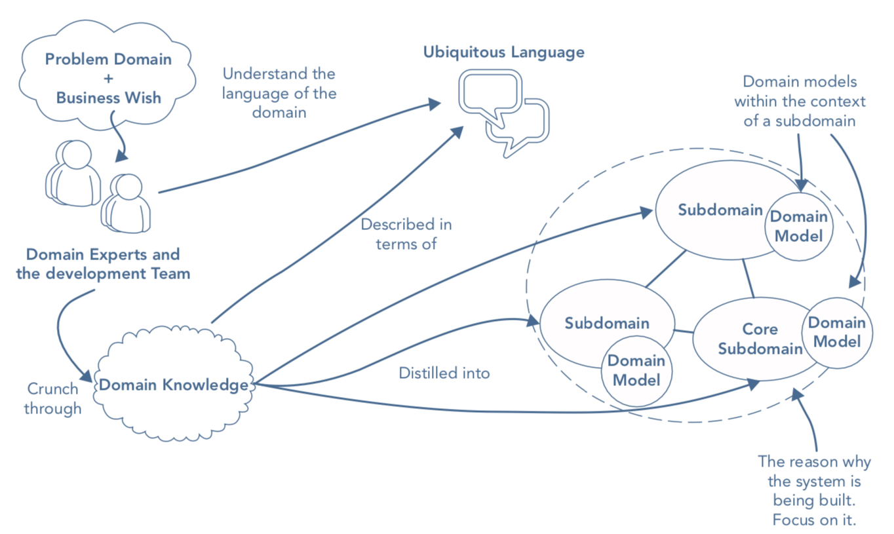
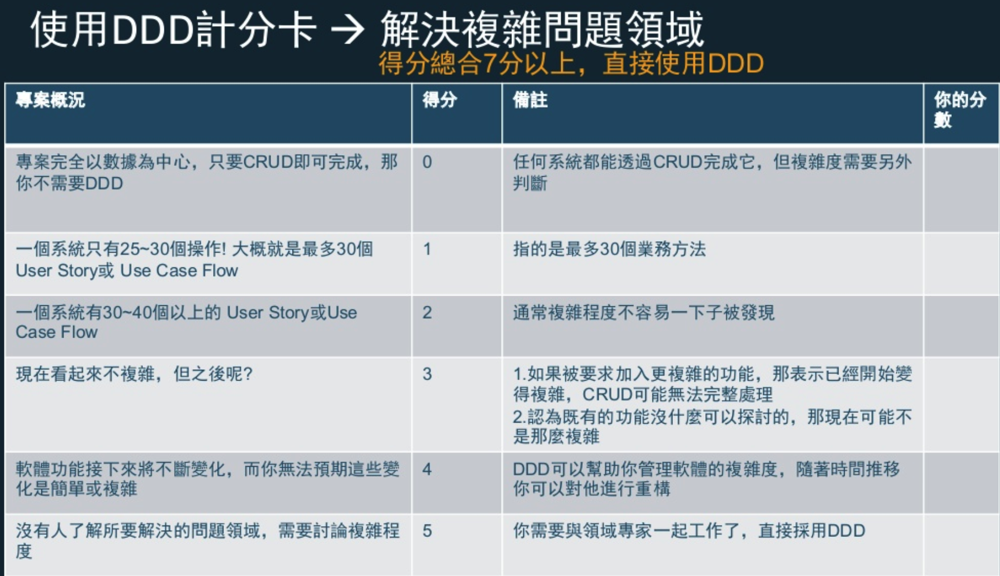

# 關於 Domain-driven Design

在我剛開始工作時，曾思考這個行業的價值與未來在哪里，直到有天我翻到了一篇文章，裡面有一句話打動了我：

> 在這個時代，寫程式從來沒有那麼簡單過，但要解決的問題也空前的困難。

軟體的核心是他為使用者解決領域相關問題的能力。隨著許多如金融、電商、社交等行業提供的服務越來越強大，軟體的需求也跟著複雜起來，身為一名工程師已經不能單純只是把一顆螺絲釘做好就能完成任務。

大多時候，程式設計的重點並不在於用哪個框架技術或優化幾個百分比，而是在於**是否能忠實解決業務的需求** 。

因此 Eric Evans 發明了領域驅動設計 (Domain-Driven Design ，之後簡稱 DDD) ，提倡開發人員也需要與領域專家合作以獲取足夠的業務知識 (business knowledge)，接著將領域知識與業務邏輯注入進程式碼模型之中，達成「程式即設計、設計即程式」的境界。

運用了這套模式，一來程式碼功能一目瞭然，二來可以有效保護我們的業務邏輯不被竄改，甚至可以適應未來業務邏輯的變化與成長。

**DDD 最大的價值之一就是把將商業領域的知識映照到程式碼中，解放「程式歸程式，業務歸業務」的傳統思維**，在過程中甚至可以打破商業團隊與工程團隊間的藩籬，甚至會讓人感覺到：

> 開發其實是一場學習的過程，程式碼只是過程的副產物。

## DDD 是什麼

介紹 DDD 是什麼之前，我們先定義領域 (Domain) 是什麼。廣泛來說， domain (knowledge) 是指「一塊知識的範圍」。實務上，就是指「你工作上所需的一切知識集合」，包含「問題」以及「解決方案」。

因此， DDD 就是一個以**商業知識與語言**為程式設計準則以**解決複雜業務問題**的軟體開發方法論。

他有以下三個重點：

1. 跟領域專家 (domain expert) 密切且迭代地合作來定義出 domain 的範圍及相關解決的方案。
2. 切分 domain 出數個 subdomain (子領域) ，並專注在核心 subdomain 。
3. 透過一系列設計模式，將 domain 的知識注入進程式模型 (model) 中。

現代軟體的複雜特性，沒有一個人或是團隊可以單獨掌握所有的知識細節，甚至連領域專家的理解都可能有所缺漏。為了要盡可能獲取知識的全貌，我們需要持續不斷進行團隊溝通以及與客戶交流。而在這個過程中，我們將知識提煉出來，進而形成**通用語言 (Ubiquitous Language)**。

在神話故事[巴別塔](https://zh.wikipedia.org/wiki/巴別塔)中，上帝分化人類的語言讓他們彼此無法溝通以懲罰他們的自大。有趣的是，在應用 DDD 的過程，不同團隊藉由溝通形塑出 Ubiquitous Language ，讓彼此互相理解，進而開發正確的軟體，~~最後發大財~~ 。


(工程與商業交流後，發現其實需要的不過是訂單、商品與會員管理三個功能)

整個過程可以參考這張圖：

(source: [Patterns, Principles, and Practices of Domain-Driven Design ](https://www.amazon.com/Patterns-Principles-Practices-Domain-Driven-Design/dp/1118714709))

至於該怎麼做到有效溝通，會在之後的章節介紹 Event Storming 事件風暴。

### DDD 的設計模式

與領域專家討論出 Ubiquitous Language 後，就可以開始套用 DDD 的各種設計模式，而這些模式大致上可以分為兩類：Strategic Design (戰略設計) 與 Tactical Design (戰術設計)。

- Strategic Design 戰略設計：利用與領域專家溝通的結果，將問題拆分出數個問題子領域以及提出對應的解決方案(系統)，並定義解決方案間的依賴關係。
- Tactical Design 戰術設計：又稱 Model-Driven Design ，基於 Strategic Design 的解決方案作為系統邊界，利用一系列的設計模式將業務邏輯化為程式碼，保護業務核心的穩定性。

以上兩個模式就是之後本系列的主軸。

## DDD 帶來的改變

前面講了很多抽象的詞彙如提升業務理解、保護商業邏輯等等，讓我們來看一下在實作上，應用了 DDD 精神的程式碼會帶來什麼樣的改變。

開始前想跟大家先介紹一個有名的反模式: [貧血模型 (anemic model)](https://martinfowler.com/bliki/AnemicDomainModel.html)，這個反模式泛指那些只有 `getter` 與 `setter` 的 model 。這些 model 缺乏行為能力，導致使用的人每次都要自己組合出自己要的功能。

因此貧血模型看似什麼都可以透過資料設定去做到，但因為沒有具有行為敘述的 method function ，所以難以應用於複雜的操作中。總體而言能力十分受限，就像貧血一樣。

> 貧血模型用起來像在教小孩子一樣，一個指令一個動作還很容易忘掉 ；具有行為能力的模型則像跟大人溝通一樣，一個命令就能完成許多指令。

再舉個例子，相信很多人都知道快打旋風、小朋友齊打交等格鬥遊戲。遊戲中角色若是要發動招式，就需要透過組合按鍵如「上跳攻」、「上上下下左右左右 BA」等等。 (小時候還會拿筆記本特別抄下來)

沒有行為能力的程式模型，就像這段組合鍵的程式碼一樣:

```java
Role person  = new Person();
// dragon fist starts ~~
person.up();
person.down();
person.left();
person.right();
person.press('A');
person.press('B');
// dragon fist ends ~~
```

但當我們了解業務邏輯後，就可以將這段程式封裝成有行為能力的 function：

```java
Role person = new Person();
person.dragonFist();
```

這樣的優勢非常明顯，一來程式易懂好維護 (想想下一個接手的人)，二來未來不管任何異動都簡單很多。重點是程式碼從組合碎片式的資訊轉而關注**程式的行為能力**。

但這時可能有人就會有疑問...**封裝的好處我懂，但如果濫用了程式碼一樣亂啊！**

### 配合業務語言封裝程式的行為

DDD 會將業務語言注入程式之中，所以**只會對重點業務行為進行封裝**。如此一來，程式模型就與業務邏輯綁在一起，不但不怕業務需求的變更，利用業務語言做封裝也解決了程式設計師的[兩大難題](https://martinfowler.com/bliki/TwoHardThings.html)之一：命名。

大家可以嘗試看看用業務行為為程式碼命名。最常見就是將原先 CRUD 的貧血命名法更改為充滿業務含義的命名方式。

比如說一個 user 的 CRUD 可能就變成 `register`, `getProfile`, `getActivityHistory`, `updateProfile`, `changePassword`, `deactivateAccount`, `deleteAccount` 等等。

這種做法會在跨模型的情境下發揮更大的優勢，舉個咖啡廳的例子，假如一個正常流程包括點餐、製作、送餐，可以寫出以下程式碼：

```javascript
customer = new Customer('Bill');
order = Order.create(customer, 'Coffee');
staff = new Staff(9527);
cashier = new Cashier();
// 結帳
order.setStaff(staff);
staff.setCashier(cashier);
staff.setOrders(order);
cashier.addOrder(order);

// 泡咖啡
cup = new Cup();
staff.setCup();
cup.setFilterCone(new FilterCone());
cup.setCoffeeGround(new Coffee());
staff.brew(cup);
staff.wait();
staff.setFilterCone(null);

// 送餐
staff.setCoffeeTo(customer);
customer.setCoffee(order);
```

以上的程式碼可以明顯看出幾個問題：

- 所有屬性都可異動
- 難讀、業務意圖不明顯
- 難以應付未來的修蓋

導入 DDD 並與領域專家不斷溝通形成 Ubiquitous Language 後，讓我們修改一下程式碼：

```javascript
barista = new Barista(9527);
customer = new Customer('Bill');
order = Order.create(customer, 'Coffee');

customer.placeOrder(order);
barista.processPayment(order);
barista.make(order);
barista.serveOrderTo(order, customer);
```

修改後可以發現，程式的行為都十分貼近現時使用情境，讓即使不會寫程式碼的人都可以看懂了！

## 使用 DDD 的優缺點

使用 DDD 有以下優點：

1. 促進跨團隊的溝通。
2. 專注在核心業務上
3. 更精準的捕捉 Use Case。
4. 保護業務邏輯，不會因技術細節 (如 db 、框架、基礎設施)而影響。
5. 開發時更靈活彈性、重用程式更方便，不會被繁複的業務邏輯卡住。
6. 更好的模組化 = 更容易測試 (完美搭配 TDD)。
7. 出現 Bug 時更快找到原因 (已經將關注點分離，查出哪邊出問題很快)。
8. 有利用拆分與設計 microservice (這也是最近幾年紅的原因)
9. ~~少加班，發大財。~~

不過也有以下缺點：

1. 不能幫助找到對的商業模式
2. 不適合建立 MVP 驗證商業模型
3. 不能快速建立產品
4. 需要豐富的領域知識
5. 學習成本高
6. 不適合高度科技專業的專案

如果還不確定是否該引入，可以參考這張 DDD 適合度計分卡:


(source: [2019-02-20-ddd taiwan-community-iddd-studygroup-1st](https://www.slideshare.net/kimKao/20190220ddd-taiwancommunityidddstudygroup1st))  
(origin post: http://www.informit.com/articles/article.aspx?p=1944876&seqNum=2)

## Common Questions

### 1. 什麼！？那不就代表我必須離開電腦先跟業務人員開一堆會嗎？

沒錯，乍聽之下增加了開發人員不少的負擔，但如果這節省了未來讀 spec 、改需求、維護、 debug 的時間，我相信仍是超值的。

### 3. 我只是個小/新創團隊

很多人會把 DDD 看似繁重的設計當成敏捷開發的絆腳石。老實說，對於只是要開發 CRUD 的早期專案來說，是有點殺雞焉用牛刀。
但是 DDD 仍可以帶來幾項巨大的優勢，詳細可以參考這支影片 [Turn your startup in a stayup with DDD — Marijn Huizendveld](https://www.youtube.com/watch?v=E8QAa55tCtw)。

- 加深對於領域的理解
- 更加專注在核心領域上

不過也是有社群的朋友分享即使是小專案，他也會利用 DDD 的部分 pattern 來快速建立模型。所以這部分其實見仁見智，對於 DDD 相當熟悉的人其實反而能在開發上更快速、正確的開發。

### 4. DDD 是萬能的嗎？

沒有什麼方法是銀子彈，只是各取所需罷了。 DDD 的強項在於解決複雜的業務邏輯以及拆分他們。因此搭上了 Microservice 的熱潮。很多人想引用 Microservice 卻不知如何正確拆分他們， DDD 此時提供了絕佳的切入點。

最後我必須強調， DDD 是一種設計方法，而設計本身沒有對錯，實作方法也有很多，不要只想著追求正確答案與完美設計，動手開始做才能做中學！

### 5. Ubiquitous Language 跟商業(業務)語言到底有什麼差別？

Ubiquitous Language 的意涵其實很簡單，可以視為一個**被系統所需要**且開發團隊與商業團隊**都能理解**的單字庫。以電商來說，「下訂單」這個詞兩邊都能理解且被系統需要，那個詞就可以被放進 Ubiquitous Language 中，而「顧客轉換率」、「公司營收」等商業用語若是與系統無關，就不在 Ubiquitous Language。

## Resources

- [An Introduction to Domain Driven Design and Its Benefits](https://dzone.com/articles/an-introduction-to-domain-driven-design-and-its-be)
- [Getting Started with Domain-Driven Design](http://www.informit.com/articles/article.aspx?p=1944876&seqNum=2)
- [2019-02-20-ddd taiwan-community-iddd-studygroup-1st](https://www.slideshare.net/kimKao/20190220ddd-taiwancommunityidddstudygroup1st)
- [Domain-driven Design -- What is it and how do you use it?](https://airbrake.io/blog/software-design/domain-driven-design)
