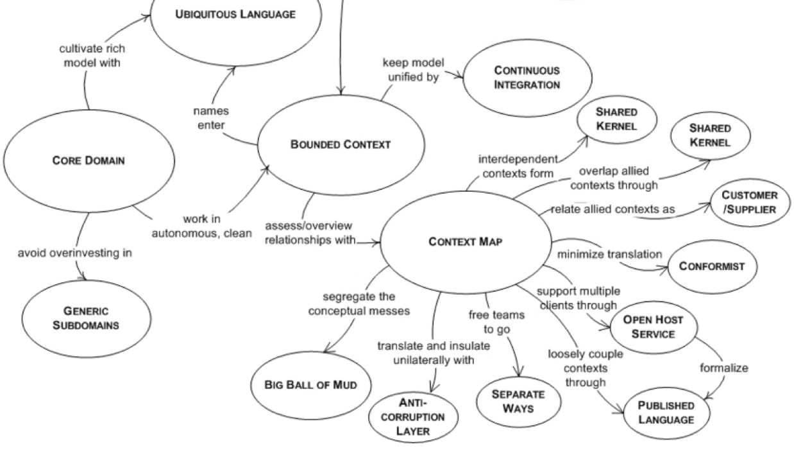
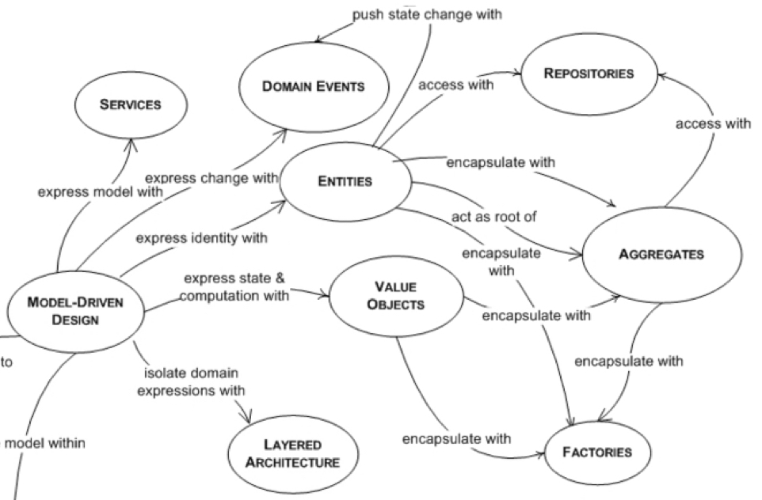

# DDD 系列文章簡介與資源分享

經過昨天的傳教文章，今天來為各位簡單介紹一些 DDD 學習路線以及這系列文章會涵蓋的範圍。
最後再附上我覺得非常有幫助的各種資源。

## 🗺 Learning Roadmap

DDD 主要分為兩大部分，分別為：

- Strategic Design 戰略設計：利用 Use Case 捕捉業務模型拆分出 Subdomain ，並依此建立 Bounded Context 。
- Tactical Design 戰術設計：又稱 Model-Driven Design ，利用 Strategic Design 建立好的邊界與語言，透過一系列的 pattern 化為程式碼，保護業務核心的穩定性。

以下這張圖完美呈現了整個 DDD 的模式概覽:

(source: https://domainlanguage.com/wp-content/uploads/2016/05/DDD_Reference_2015-03.pdf)

### Strategic Design 戰略設計

戰略設計目的在於協助我們建立 domain knowledge 並將其拆分成合理的區塊一一處理，同時也使我們理解軟體的核心價值在哪裡。戰略包括：

- 與領域專家互動建立 Domain 與解決方案。
- 將 Domain 切成若干 Subdomain 並找出 Core Subdomain 。
- 對應 Subdomain 來為解決方案做分類並建立邊界： Bounded Context (限界上下文，之後會詳談) 。
- Bounded Context 同時也有語言邊界的功能，所以可以在其中定義 Ubiquitous Language 。
- 定義不同 Bouund Context 之間的互動模式 Context Mapping 。

歷史小補充: 在 DDD 剛推出時，因為戰略部分非常抽象，所以很多人只學習可以立即導入程式碼中的戰術設計，因此這種只使用戰術模式的 DDD 實踐方式又稱為 DDDLite 。不過隨著程式碼逐漸增長，大家逐漸意識到沒有做好戰略設計，即使加入再多的戰術程式碼都是脆弱的。因為有了戰略打穩地基，團隊有了充足的領域知識與通用語言做後盾，才能準確設立系統的邊界以符合業務需求。

### Tactical Design 戰術設計

戰術設計幫助我們運用一些成熟的 design pattern 將 Bounded Context 轉為程式碼。有以下 Design Pattern 供使用：

- Entity: 有 id 概念、狀態可被變更的物件。
- Value Object: 無 id 概念、狀態不可變更的物件。
- Aggregate: 由一堆有相關業務目的的物件 (包含 Entity 與 VO) 組成的集合，會選一個 Entity 作為 Aggregate Root 。
- Domain Model: 以上三個因為負責處理系統的業務邏輯，因此統稱為 domain model 。
- Repository: 用於程式與資料庫交流的抽象層，通常一個 Aggregate 會對上一個 Repository 。
- Factory: 用於產生複雜的 Aggregate 、 Entity 、 Value Object 的工廠模式。
- Domain Event: 某件領域專家在乎的事件，通常用於 Aggregate 間或 Bounded Context 間的溝通。
- Application Service: 等同於系統的 Use Case ，主要負責技術細節並呼叫 domain model 、 domain service 處理業務邏輯。
- Domain Service: 負責跨 domain model 的業務邏輯運算，處於 Application Service 與 domain model 之間。

## 🗽 本系列風格說明

由於 DDD 大部分資源都以英文為主，且中文翻譯又容易有歧異，所以為了希望大家未來能無縫接軌英語資源，在專有名詞使用上，我都盡量以英文呈現 (如 Bounded Context, Subdomain 等等) 。因此會出現大量「晶晶體」也請多見諒。

本系列我主要是參考 [Implementing Domain-Driven Design](https://www.tenlong.com.tw/products/9787121224485) (簡稱 IDDD) 為主，此書實作內容非常豐富。不過不太建議新手直接拿來啃，最好是搭配本系列一起服用 XD

同時偶爾參考元祖書 [Domain-Driven Design](https://www.tenlong.com.tw/products/9789864343874?list_name=c-domain-driven-design) 與另一本好書 [Patterns, Principles, and Practices of Domain-Driven Design](https://www.tenlong.com.tw/products/9781118714706?list_name=srh) 還有一堆網路文章與影片。

在程式語言實作方面，由於我熟悉的語言如 NodeJS 、 Python 等都不是純粹的 OO 語言，所以我就選用 TypeScript 作為開發範例程式碼。如果你是用 JAVA 、 C# 、 PHP 等的朋友們...我只能說恭喜拉！網路上超多程式碼資源(尤其是 C#) ，可以從我這邊理解概念後再上網找範例程式碼。

為了讓大家能快速上手 DDD 的概念，實踐方面我盡量都會寫出範例程式碼，但因為 30 天的極限挑戰下，若有錯誤也請各位不吝指出，我會立即修正，謝謝。

## 📖 目錄

戰略部分會依照以下順序展開：

- Subdomains & Bounded Context
- Context Mapping Patterns
- Event Storming

結束戰略銜接戰術前，我會先介紹一些現代的架構以支援戰術與戰略的融合：

- Layered Architecture
- Onion/Clean Architecture
- Port-Adapter Architecture
- Communication with other Bounded Contect
- BDD with use cases

接著再進入大家期待的程式實作戰術設計：

- Entity
- Value Object
- Aggregate
- Factory
- Application Service
- Repository
- Module
- Domain Service
- Domain Event
- CQRS & Event Sourcing (不一定)

最後有時間的話會找幾個簡單的 project 跟大家一起實作。

## 🎁 資源分享

非免費資源我會在後面標注星號

### 書籍

- [Domain-Driven Design \*](https://www.tenlong.com.tw/products/9789864343874?list_name=c-domain-driven-design) 俗稱小藍書，看了會有很多收穫但稍嫌抽象。可以買一本供奉著。
- [Implementing Domain-Driven Design \*](https://www.tenlong.com.tw/products/9787121224485) 小紅書，也是本系列主要參考對象，以 JAVA 實現，雖然年代稍久，但實作面很強的一本書，很建議與本篇一起閱讀。
- [Patterns, Principles, and Practices of Domain-Driven Design \*](https://www.tenlong.com.tw/products/9781118714706?list_name=srh) 另一本很推薦的書，尤其適合熟悉 C# 的朋友入手。很建議與上面那本搭配閱讀。
- [DDD Reference](http://domainlanguage.com/ddd/reference/) DDD 專有名詞對照書。
- [Domain Driven Design Quickly](https://www.infoq.com/minibooks/domain-driven-design-quickly/) [簡中版](https://www.infoq.cn/article/domain-driven-design-quickly?fbclid=IwAR1evqEP9h3Kj04tU5N0_oUPydmJmsuNahKUKqwz3TKgL84izTfxY9g39ks)
- [GETTING STARTED WITH DDD WHEN SURROUNDED BY LEGACY SYSTEMS](http://domainlanguage.com/wp-content/uploads/2016/04/GettingStartedWithDDDWhenSurroundedByLegacySystemsV1.pdf)
- [Domain-Driven Design: The First 15 Years](https://leanpub.com/ddd_first_15_years) DDD 歐洲社群精選幾篇文章後出版了此書，適合有一定經驗的讀者閱讀。

### 文章

- [Martin Fowler - DDD series](https://martinfowler.com/tags/domain%20driven%20design.html) 看來連馬丁花都是 DDD 的粉絲呢～
- [InfoQ Domain-Driven-Design](https://www.infoq.com/domaindrivendesign/) 裡面蠻多簡中與英文的資源
- [ThoughtWorks](https://www.thoughtworks.com) [簡中](https://info.thoughtworks.com/CN-Company-Introduction.html) 裡面也有許多高質量文章
- [Microsoft .NET DDD Guide](https://docs.microsoft.com/zh-tw/dotnet/architecture/microservices/microservice-ddd-cqrs-patterns/)
- [khalilstemmler](https://khalilstemmler.com/articles/categories/domain-driven-design/) 蠻多 TypeScript 實作。
- [Udi Dahan ](http://udidahan.com/articles/)
- [LosTechies.com](https://lostechies.com/jimmybogard/2010/02/04/strengthening-your-domain-a-primer/)
- [知乎 DDD ](https://www.zhihu.com/topic/19826540/hot)

更多資源可以上 [Awesome DDD](https://github.com/heynickc/awesome-ddd) 查看～

### 線上課程

- [Domain-Driven Design Europe Youtube Channel](https://www.youtube.com/channel/UC3PGn-hQdbtRiqxZK9XBGqQ) 非常推薦！裡面有很多演講影片可以拿來配飯吃。
- [PLURASIGHT - Domain-Driven Design: Working with Legacy Projects \*](https://www.pluralsight.com/courses/domain-driven-design-legacy-projects)
- [PLURASIGHT - Domain-Driven Design in Practic \*](https://www.pluralsight.com/courses/domain-driven-design-in-practice)

### 最強社群

現在就加入 [Domain-Driven Design Taiwan](https://www.facebook.com/groups/dddtaiwan/) ，隨時更新活動與新知！
最近才剛辦完耗時半年的 Implementing Domain-Driven Design 的讀書會，如果對讀書會有興趣請密切關注！
