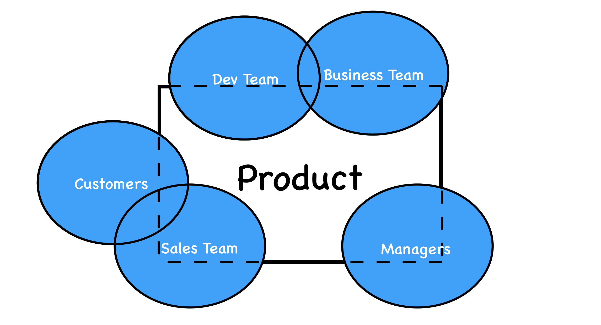

# 事件風暴 Part 1 - 事件搜集

在進行 Strategic Design 時，最重要的就是與領域專家的溝通與合作。說起來簡單，但事實上人際關係的合作可能比寫程式還要複雜。另外，越複雜的產品的領域知識是跨團隊的，沒有任何單一團隊可以掌握他的全貌。

(一個產品的領域知識往往是跨團隊的。本圖僅示意圖，請勿計較精確度。)

2013 年，一位義大利人 [Alberto Brandolini](https://medium.com/@ziobrando) 為了有效與領域專家溝通捕捉使用案例因而發明了 Event Storming 工作坊，有效解決開發團隊與領域專家溝通的問題。

接下來我將用三篇來為各位介紹這項溝通流程神器，分為「事件搜集」、「整合歸納到開發」以及「如何可以做得更好的小建議」。這三篇我會盡量用最簡短的語言並且與前面幾篇獨立出來，讓不熟悉 DDD 或是尚未看過前面篇的朋友們可以快速理解。

這邊先聲明，**使用事件風暴不代表一定要採用 DDD，只要你有意想促進團隊的溝通與領域知識的理解**， Event Storming 永遠都是你的選項之一！

今天的我會涵蓋以下內容：

- Event Storming Overview
- Round 1: 展開風暴
- 從 Event 開始
- Event Triggers 介紹
- 一些小建議

另外，在這邊我會使用中英夾雜的方式，如果我是指「某個便利貼」我會用英文如 Event、Command 來敘述，如果只是單純敘述事情我會用中文如事件來描述。

## Event Storming Overview

Event Storming 是一個透過**高度互動**的方式，將企業或系統的**商業流程視覺化**，最終協助建立**軟體模型**的工作坊。簡單來說就是探索功能、找出盲點、建立共識。

跑完後，與會者們都將會獲得：

- 對於商業流程的**共同理解**，包含名詞使用、系統責任範圍、使用者如何使用軟體、UI 設計方向等。
- 一份整體流程的**概覽圖 (Big Picture)**，讓與會者之後可以快速回憶會議內容，之後也可以數位化製成文件。
- 可以找出流程中的風險與機會。
- 可以開始進行 Strategic Design 的領域知識

整個過程中會用便利貼來視覺化流程，不會有艱深的技術詞彙或商業報表，只會有團隊學習與多元觀點的對話。實際跑起來會像是這樣：

從商業層面來看， Event Storming 提供了一個 Big Picture 來辨識出問題的癥結會在哪，並協助做出權衡以專注在核心競爭力上；從開發層面來看，Event Storming 提供了建構軟體的方向。

### 適合的對象

如果你的工作流程出現以下症狀，請儘早啟用 Event Storming：

- 需求書瑣碎、難以理解、沒有明確架構
- 討論時常陷入細節爭論或是過多的技術詞彙讓主題失焦
- 開發到一半還在理解功能在幹嘛
- 等到上線了才發現一堆商業流程的 Bug

### 可以應用在哪裡

使用的時機點從巨觀到微觀：

- 想要理解商業流程的全貌 (Big Picture) - 釐清混亂
  - 邀請任何有興趣的人
  - 不用限制討論範圍
  - 找出瓶頸風險與核心價值(問題)
  - 利用圖像理解大方向
  - 可以只用 Event
  - 適合新創或小團隊(人少、技術債少)
  we’ll build a behavioral model of an entire line of business, highlighting collaborations, boundaries, responsibilities and the different perspec- tives of the involved actors and stakeholders;
• we’ll discover and validate the most compelling problem to solve;
• we’ll highlight the significant risks involved with the status quo and
possible new solutions.
  - [參考](https://philippe.bourgau.net/4-tips-that-will-make-your-ddd-big-picture-event-storming-successful/)
- 為流程建立模型 -> Make sure we're doing the right thing
  - 有明確範圍
  - 討論詳細流程。
  - 找出邊界問題。
- 進行程式設計時要建立軟體模型 (Software Design)
  - Corporate bullshit does not compile (企業的流程不會自己編譯自己)
  - 有明確範圍
  - 找出 Aggregate、Bounded Context、Ubiquitous Language
  - 對於用詞更加精準

此外， Event Storming 也可以作為員工訓練，讓新進員工快速上手領域知識。

## 事前準備

人事時地物都要準備好。

### 場地設置

- 找到一面**限制最少的表面**來進行活動。
  不管是牆面、窗邊甚至用多面移動白板組成都可以。你無法預測最後流程成果有多長(步驟多)或有多寬(路徑多)，所以盡你所能，畢竟你不會想要因為空間而限制活動的品質。
- 將現場的雜物如桌子移開，以最大化活動空間。不過可以留下一張小桌子放道具。
- 移開現場的椅子。經驗中，只要有人坐下，就會開始沈默，最後自我放逐。
- (建議)一面白板或海報寫上**名詞清單 (Glossry)**。在這場會議中的對話都遵照清單上的用詞。
- 提供一張有圖示標明 (Legend) 的海報紙。如下：

(source: https://medium.com/@springdo/a-facilitators-recipe-for-event-storming-941dcb38db0d)

我自己在進行時還會貼上其他的圖標海報，為了不佔空間，我會在底下介紹到這些便利貼時再貼出來。

完成以上設置，你會得到以下的畫面：

(source: https://leanpub.com/introducing_eventstorming)

### 邀請對的人

這是最重要的元素。一場 Event Storming 會需要以下角色：

- **主持人 Facilitator**:  
  建議一定要有一名參與者負責主持會議進行、推動議程討論。要嚴格注意時間與流程。最好不要跟 Domain Expert 重複。
- **領域專家(們) Domain expert(s)**:  
  專案的主要推動者，或是擁有足夠領域知識的人，建議最好有一定的決定權，在陷入泥沼時才可以做出決定。如果是新創領域，可以事先做好使用者訪談或是找使用者來參加。可以不只一名。
- **其他利益相關者 Other Stackholder**:  
  可能是參與專案的工程師、設計師，也可能任何能提供專業意見的人士如業務、商業分析師甚至是主管。

通常一場會議 6-8 人就可以進行一場精彩的 Event Storming，至於超過 10 人以個人經驗來說場面就會開始混亂起來(除非主持人經驗豐富)。

### 火力展示你的道具

你需要「非常多」的便利貼。千萬不要因為省錢就少買某個顏色，因為每個顏色都有各自的意義，無法互相替代。你會需要以下顏色的便利貼：

- 橘色(正方形)：Event 事件
- 藍色(正方形)：Command 命令
- 黃色(小張長方形):Actor 角色
- 紫色 (長方形): Policy/Process 商業政策/流程
- 粉紅色(長方形)：System 外部系統
- 紅色(正方形):Question 疑問/盲點
- 綠色(正方形)：Read Model 資料讀取模型
- 白色(超大張正方形)：Uset Interface 使用者介面

以及其他道具：

- 一張很長很長的海報紙。可以貼在牆上方便替換下一次會議。
- 簽字筆。每個人至少一支。
- 一隻粗一點的奇異筆。
- (推薦)計時器。可以幫助時間控管。
- (選用)投影設備。方便讓領域專家解說需求。

可以參考這張[購物清單](https://www.amazon.co.uk/registry/wishlist/2AWT7JZNMLAW6/ref=cm_sw_r_cp_ep_ws_N0ISBbQBYDFFD)

### 滿滿的能量

Event Storming 超級耗費心力，可以喝杯咖啡後再上路。或是在周圍放些小點心。

## Round 1: 從 Event 開始

終於，我們要開始展開風暴了。首先會由領域專家簡介專案需求，然後由領域專家(或是主持人)在畫面正中央貼上第一張 Event。貼在中間一方面可以靈活拓展，另一方面也能讓所有人一起參與。

如果該專案已經有很明確的開始與預期結果，那可以貼上開頭的 Event 加上結尾的 Event ，讓參與者對於專案需求有明確的範圍 (scope)。

接著，讓我來介紹什麼是 Event。

### Event 代表已經發生的事

1. it has to be an orange sticky note5;
2. it needs to be phrased at past tense, as item added to cart or ticket
purchased;
3. it has to be relevant for the domain experts.

The Event will be the building block of our business-related storytelling. We’ll build our narrative as a sequence of related events.

這邊的 Event 代表**領域專家所在乎的事件**，至於事件通常都是「已經發生過」的事情，因此要用過去式（英文就用 ed ，中文用「已」)

會用過去發生過的事件來代表其實很合理，因為事件就像是商業流程的一個個節點，當你確立好節點後，會更好去思考中間的關聯性。

比如，訂單已成立、貨物已送出、早餐已買到等等。

此外，他也可以加上時間概念，如「午夜十二點已變成南瓜」。甚至是某個時間點，如「已過了一個月」。

另外也可以加上一些原因加強語意，如「因為密碼輸入錯誤三次，所以帳號已被鎖住」。

在這階段，請大家可以自由的將 Event 貼到牆上，不過要請大致遵守由左到右的時間軸，不要錯亂順序。大家想到什麼就貼什麼，即使重複也沒有關係。通常這個階段不會互相交談，大家個做個的，也不需要領域專家參與，以免限制大家表達自己理解的權利。

這邊主持人要盡量引導大家去表達自己的看法。一開始不熟悉 Event Storming 的話大家會因為害羞而不敢動手。主持人就可以用問問題的方式引導大家。

### 由左到右的時間軸

在張貼過程中，由於事件本身有時間性，所以務必要求大家遵照時間發展順序從左至右貼上去。

### 可以有平行事件

如果兩件事情的順序不重要，或是同時發生的事情，那可以上下並列來呈現。

### 先從 Happy Path 下手

系統的商業流程複雜度可能會超乎想像，如果加上各種意外路徑就沒完沒了，因此建議大家先從 Happy Path 也就是成功的那條路徑下手。
至於其他路徑可以待之後加入其他 Event Trigger 時再加入。

但如果遇到 Happy Path 也有兩個分支再進行的話，那可以考慮再拿一張橘色便利貼畫個箭頭指向不同路徑的 Event 以代表兩著同時進行。通常發生在多角色參與系統的情況。

比如商家上架商品後，就有可能出現商家行為的路徑與消費者行為的路徑。

## Round 2: 整理 Events 後再出發

當大家都好了之後，主持人可以請領域專家上去將上面的 Event 做整理，將重複的碟再一起，不重要的就放到邊邊(別丟掉！未來可能會用上)，如果有問題就問寫的人或跟大家討論。

大致整理好 Event 後，領域專家或是主持人可以請現場一位與會者上台從頭到尾講解一次流程。

### 不要放過任何模稜兩可

一開始一定會出現同樣的 Event 卻用不同的名詞或寫法呈現，這時候領域專家就必須要決定或是跟大家達成共識，到底要用哪個用詞。又或者當領域專家的某個概念講解不清時，與會者也要有責任提出問題請領域專家釐清。

當領域專家表達完他的看法後，就可以進行下一個回合再補上新的或修改目前的 Event。此時大家可以跟領域專家討論相關的細節。當大家都沒有要補充的時候，就近到下一回合。

## Round 3: 標記出問題或是機會

接著，每個人手上可以拿著紅色便利貼 Question 在上面找出你覺得有疑問、成本高、會出錯的 Event 貼上去。你可以在 Question 上標明你的問題點或是實際的困難點。

常見的問題有：

- 我看不懂
- 商業邏輯有問題
- 與現有專案架構不合
- 會造成使用者不爽

同時你也可以拿一張綠色的便利貼 Good Point 將你覺得有價值的 Event 標記出來。

標記問題通常不會花很久，但是討論這些問題會花非常久，因為這些問題都有可能成為後來的瓶頸，因此要一一解決。這個過程中你可以提早發現問題也有可能找出你這個專案的核心競爭力（你解決別人解決不了的問題）。

主持人這時要注意會議的時間，很容易大家討論討論就陷入細節討論。此時主持人要適時介入，將無法立即解決的問題記錄下來待之後的會議解決。此時如果有個計時器就可以用來提醒大家不要超時，比較不會傷感情 XD。

通常到這邊，就差不多兩個多小時過去了。主持人可以考慮休息或是再安排下一場會議擇日再戰(大家也累了)。

## Round4: Add Event Triggers

蒐集完大致的 Event 後，我們進入下一個階段：加入 Event Triggers (事件觸發器)來找出被我們忽略的其他 Event。這裡會介紹 Actor、Command、External Ssytem、Policy 等元素。
這一階段你將會探索系統中不同的使用路徑並更加了解流程。

流程上可以先加上 Command 後再加上 System 與 Policy。

### Command 命令與 Actor 角色

Command 是一個使用者(或軟體)所做出的**決定**。讓我們站在使用者角度思考。

如果 Event 是一個個的節點，Command 就是節點間的線，同時也是我們要建構軟體模型時，需要實作的行為。大部分的 Command 與 Event 都像是對稱的存在。比如「已經買早餐」Event 前面就會加上一個「買早餐」Command。
當然，Command 一定由某個使用者（實際的人、虛擬的系統）所發出，因此可以在 Command 的左邊貼上 Actor 標籤。

給大家一點時間，把 Command 加上去。原則上要讓畫面上的流程能夠流暢的走完。

// 圖
// legend

### Read Model

不只是 DATA，同時也是做決策的工具。

有時候，當你需要做決策時，需要一些數據做參考，這時候你就可以貼上 Read Model。

The Command represents a decision made by a user in response to some information retrieved from the Read Model. The Actor is the person who issues the Command and the System is the thing that receives the Command. It is the responsibility of the System to respond to the Command and therefore trigger an Event.

### UI

你可以依照上面 Read Model 的需求簡單畫出一個 Wireframe 供設計師參考。

### System & Policy

在系統開發中，難免會需要與外部系統合作完成功能。這個外部可能是公司裡的另一個系統、第三方服務、甚至是法條(ex: GDPR)。

System 通常是由 Command 所觸發（ex: 第三方金流外部服務由「付款」觸發)，然後 System 會再產生新的 Event。這邊領域專家需要注意，他要將屬於外部系統不屬於自己系統關注的 Event 移出，比如說外部物流系統可能有「買家揀貨」、「超商拒收」、「超商驗貨」、「送貨中」、「商品已到指定超商」等等 Event，但事實上你的系統可能只在乎他最後到貨的 Event。

同時，System 也會觸發不同分支的 Event，就像是外部系統總有成功與失敗的可能，此時領域專家與與會者就要一起思考失敗的處理路線是否是系統所關注的。

// 圖
// legend


Policy 就是我們的系統如何對於特定 Event 的回應。「 Whenever Event Then Command 」。這裡有可能說謊的地方。當有人說「總是、立即」，當我們想要退款時，總是會立即退款。挑戰他：除非有對方的帳戶且合法。挑戰立即，銀行可能會在固定時間對帳。

找出規則、潛規則以及自動化(listener, saga, process modeliing)。

軟體之所以有價值，就是因為他可以將很多商業邏輯自動化。在 Policy 這邊，凡是系統中自動或手動的演算法或決策都可以標記上去。他的使用與法式「凡是...就...」(Whenever...then...)，所以會接在某個 Event 後面然後觸發一個至多個 Command。甚至可以加上額外的條件如「凡是...但如果...就...」。

比如最常見的訂單對帳。當「訂單已對帳」Event 發出後就會觸發 Policy 「凡訂單已對帳，就寄信通知」、「凡訂單已對帳，就更改訂單帳款資訊」等等。

Policy 就像 Event Storming 的偵探一樣，可以找出許多尚未發掘的問題或是現有流程矛盾之處。

// 圖
// legend

Fun Fact: 通常用紫色 (lilac)，因為是 Event 與 Command 顏色混合。

## 一些小建議

- 可以在每張便利貼上的邊邊加註不同的標誌，如 Events 是閃電、Command 是驚嘆號。這樣可以讓一些對顏色不敏感的參與者，
- 計時器，為每個回合設定一定時間 (ex: 25 min) 避免議題發散收不回來。
- 名詞清單 Glossry
- 站著最有效率
- 最好有一位專職 Facilitator ，不能與 domain expert 重複
- 中間安排休息時間，吃吃零食喝喝水
- **目的是為了讓工程師理解而非幫助 domain expert 探索產品功能**
- 若一個問題卡關太久，可能是 spec 本身就不清楚，此時可以先記錄下來，待之後領域專家開會去討論
- 不要怕浪費，不然可以考慮使用線上版工具 [Miro](https://miro.com/app/dashboard/)。

(Miro 使用示意圖)

### Facilitator 職責

一開始多鼓勵大家。鼓勵 ice breaker 第一個出來。

一開始很難遵守「過去式」因此要嚴格檢查所有 Event。

Registration, Enrolment or User Acquisition 等太抽象。

### Domain expert 職責

需要事前

## Summary

Event Storming 對於團隊來說是一個非常好的「階段式學習」過程。過程中不但可以提早發現盲點，也能讓未來開發專注在核心功能上。最重要的事，他可以讓原本各自為政的團隊有機會聚在一起達成共識。

使用 Event Storming 不但可以增加溝通與開發的效率，更重要的是帶來個人的成長。身為一名開發者，他的價值並不僅僅在於會用多少技術，也與他對於工作領域的了解程度有高度相關。當你對於某項產業的理解越深刻，加上技術能力，你就越難被取代。甚至，你可以從技術人員升為顧問，一同參與重要的商業決策。

Event Storming 是一個知識交流的絕佳場所，在打破穀倉效應 (silo effect) 的同時，商業團隊/領域專家可以重新檢視自己的知識並加上來自開發團隊的回饋（比如邊界問題、開發成本）；同時開發團隊也能對於領域知識有更深一層的了解，對於未來開發也會更有自信。

在 DDD 剛出現尚未成熟的幾年，很多人因為缺乏有效捕捉領域知識的方法，因此跳過 Strategic Design 直接採用軟體模型設計的 Tactical Design。但缺乏 Strategic Design 去深入理解領域知識，DDD 的效用也就不大了。直到後來一位義大利人 [Alberto Brandolini](https://medium.com/@ziobrando) 發明了事件風暴工作坊，有效解決開發團隊與領域專家溝通的問題，讓很多人又重新重視 Strategic Design 了！

## Resources

以下都是非常好的學習資源，每篇都值得一讀：

- [A facilitators recipe for Event Storming](https://medium.com/@springdo/a-facilitators-recipe-for-event-storming-941dcb38db0d)
- [50.000 orange stickies later](https://www.slideshare.net/ziobrando/50000-orange-stickies-later?from_action=save)
- [事件風暴-領域建模](https://www.slideshare.net/ssusercab70d/ss-125442613)
- [Modelling Reactive Systems with Event Storming and Domain-Driven Design](https://blog.redelastic.com/corporate-arts-crafts-modelling-reactive-systems-with-event-storming-73c6236f5dd7)
- [Event Storming For Rapid Domain Learning](https://keyholesoftware.com/2017/08/07/event-storming-for-rapid-domain-learning/?fbclid=IwAR00X5bn-6GWyldhdnexjY69IBm5lybZdnTWm3rzhLIO1iPXZiTxsRJerB8)
- [cheatsheet](https://eventnotes.io/pdf/cheatsheet-process-modeling.pdf)
- [A step by step guide to Event Storming – our experience](https://www.boldare.com/blog/event-storming-guide/)
- [YOW! West 2016 Paul Rayner - EventStorming #YOWWest](https://www.youtube.com/watch?v=bXm8Cznyb_s)

- [Detailed Agenda of a DDD Big Picture Event Storming - Part 1](https://philippe.bourgau.net/detailed-agenda-of-a-ddd-big-picture-event-storming-part-1/)
- [Detailed Agenda of a DDD Big Picture Event Storming - Part 2](https://philippe.bourgau.net/detailed-agenda-of-a-ddd-big-picture-event-storming-part-2/)
- [Detailed Agenda of a DDD Big Picture Event Storming - Part 3](https://philippe.bourgau.net/detailed-agenda-of-a-ddd-big-picture-event-storming-part-3/)

- [cover photo](https://unsplash.com/photos/ZODcBkEohk8)
- [DDD: Recognising relationships between bounded contexts](https://markhneedham.com/blog/2009/03/30/ddd-recognising-relationships-between-bounded-contexts/)
  Strategic Domain Driven Design with Context Mapping
- [https://www.infoq.com/articles/ddd-contextmapping/?utm_source=Facebook_PicSee&fbclid=IwAR262EUJ7_4J3QV7tf0laEJGvHIvzfe7rMxx1xUF79Lte9bAg_OYirEGuVU](https://www.infoq.com/articles/ddd-contextmapping/?utm_source=Facebook_PicSee&fbclid=IwAR262EUJ7_4J3QV7tf0laEJGvHIvzfe7rMxx1xUF79Lte9bAg_OYirEGuVU)
- [https://www.slideshare.net/YiChengKuo1/implementing-domaindriven-design-study-group-chapter-3-context-maps](https://www.slideshare.net/YiChengKuo1/implementing-domaindriven-design-study-group-chapter-3-context-maps)
