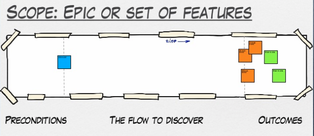

# 事件風暴輕鬆學 Part 2 - 風暴展開

本篇文將解說如何進行一場 Event Storming，流程上會混合 Big Picture 與 Process Modelling，若是

再次複習一下便利貼種類：

- 橘色（正方形）：Event 事件
- 藍色（正方形）：Command 命令
- 紫色（長方形）: Policy/Process 商業政策/流程
- 黃色（小張長方形）:Actor 角色
- 黃色（長方形）:Aggregate 聚合
- 粉紅色（長方形）：System 外部系統
- 紅色（正方形）:Hotspot 熱點
- 紅色（小張長方形）:Problem 疑問
- 綠色（小張長方形）:Opportunity 機會
- 綠色（正方形）：Read Model 資料讀取模型
- 白色（大張正方形）：Uset Interface 使用者介面

## Round 1: 從 Event 混亂開始

在 Event Storming 的開頭主持人會先請領域專家簡介專案需求，然後由領域專家(或是主持人)在畫面正中央貼上第一張 Event。貼在中間一方面可以靈活拓展，另一方面也能讓所有人一起參與。

如果該專案已經有個明確的大致流程，那可以再貼上關鍵流程如開頭結尾的 Event 或 Command，讓參與者對於專案需求有明確的範圍 (scope)。

接著，讓我來介紹什麼是 Event。

### Event 代表已經發生過的事

Event 是 Event Storming 的基礎，我們會用一系列相關的 Event 完成我們的故事。他有以下特徵：

1. 橘色便利貼。
2. 使用**過去式**（英文加 -ed ，中文加「已」)。  
   如訂單已成立、貨物已送出、早餐已買到等等。
3. **領域專家所在乎的事件**。  
   如整合第三方物流時，領域專家可能只在乎送達時間而不在乎中間細節的運輸過程。
4. 有時間性，請從左到右排列。
5. 可以加上**時間概念**。  
   如「凌晨三點帳款已對帳完成」、「午夜十二點馬車已變成南瓜」，甚至是某個時間點，如「本季度已結束」、「已過了一個月」。
6. 可以加上**原因**。  
   如「因為密碼輸入錯誤三次，所以帳號已被鎖住」。

根據 Alberto Brandolini 本人的敘述，使用過去式代表著系統的狀態。如果你今天使用的是「註冊」這類詞時，你代表的是一個流程。相對的，用「註冊已開始」、「註冊已完成」會有更好的清晰度且顆粒度，避免過度設計。

在這階段，主持人要請大家可以自由的將 Event 貼到牆上，不需要互相交流直接行動。大家想到什麼就貼什麼，即使 Event 混亂或重複也沒有關係。這個階段通常大家各做各的不太會交談、也不需要領域專家干預，以顯示出大家最直覺的理解。

同時主持人要注意兩點。第一點，主持人要反覆重申、提醒大家要用「過去式」，否則會產出很多不合格的 Event。第二，盡量引導大家去表達自己的看法。Event Storming 一開始會有些冷場是正常的，主持人可以藉由多鼓勵貼 Event 的人 (把內容唸出來)或用問問題的方式引導。

### 可以有平行事件

如果一個 Event 會產生兩個同時發生的 Event，那可以上下並列來呈現。比如「訂單已下單」可能會同時觸發「金流已處理」、「物流已處理」、「客人通知信已送出」等等。

### 先從 Happy Path 下手

系統商業流程的複雜度可能會超乎想像，如果加上各種意外路徑就沒完沒了，因此建議大家先從 Happy Path 也就是成功的那條路徑下手。
至於其他路徑可以待之後加入其他 Event Trigger 時再加入。

但通常有多種角色在使用系統時，就可能會有多條 Happy Path 同時進行，那可以考慮再拿一張橘色便利貼畫個箭頭指向不同路徑的 Event 以做出區別。

比如商家上架商品後，就有可能出現商家行為的路徑與消費者行為的路徑。

這一輪當沒有人要繼續貼或是時間到的時候，就可以進入下一輪。

## Round 2: 重新整理 Events 與保證時間軸順序

此時，主持人可以請領域專家上去將上面的 Event 做整理，將重複的疊再一起，不重要的就放到邊邊(別丟掉！)，如果有問題就問寫的人或跟大家討論。

這個過程中，大家可以發現不管是團隊間還是個人間對於同一份商業流程的理解有多麼的不同。而在領域專家整理時，也可以讓大家知道哪些 Event 重要哪些不是我們需要關注的，加深大家對於系統責任邊界的了解。再來，領域專家可以參考不同人在同一件事上不同的用詞，跟大家討論達成共識後，可以新增到名詞定義清單上。

這邊會產生很多有意義的討論。

## Round 3: 走過一遍 Events 的流程

大致整理好 Event 後，主持人可以請領域專家或是現場一位與會者從左到右「走」過一遍整個流程。想像自己是在說故事一樣，斷點、轉折點都要有！

在這個回合，同時也會將重複的 Event 疊在一起，並針對同一概念不同用詞的 Event 做討論。

### 隨時打斷、不要放過任何模稜兩可

當你對於故事的某個 Event 或轉折點有疑問時，請馬上提出，然後讓領域專家解釋或是跟大家討論。很有可能你發現了某個連領域專家都不知道、缺失或多餘的 Event。

### 標記 Hotspot

如果過程中某個節點卡住太久，很有可能是因為領域專家也不太了解這個問題，也有可能是目前資料量不足以做出決定。可以先貼上一張 45 度角旋轉後的紅色的 Hotspot 待日後解決。

一般來說，Hotspot 一方面代表你的系統的重大挑戰，另一方面如果能夠解決它就能為系統帶來巨大的價值。因此在這一回合，大家可以藉此了解系統的核心問題在哪。

## Round 3: 標記出 Question 或是 Opportunity

走完一遍 Event 後，主持人可以請大家拿出小張的紅色 Question 與綠色 Opportunity 標上去。Question 代表你覺得有疑問、成本高、會出錯的地方，你可以在 Question 寫上簡短的敘述。常見的問題有：

- 我看不懂
- 商業邏輯有問題
- 與現有專案架構不合
- 會造成使用者不爽

另一方面，Opportunity 則代表你覺得流程中很棒的部分，就像是按讚一樣不用客氣貼上去吧！

標記完後，主持人可以開始讓大家針對一個個問題來討論，由於這些討論十分耗時，如果你今天是做 Process Modelling (ex: 特定功能使用流程)，因為這些問題都有可能成為後來的瓶頸，那就建議要一一解決。

主持人這時要注意會議的時間，大家很容易討論著就陷入細節討論。此時主持人要適時介入，將無法立即解決的問題貼上 Hotspot 記錄下來待之後的解決。此時如果有個計時器就可以用來提醒大家不要超時，比較不會傷感情 XD。

通常到這邊，就差不多兩個多小時過去了。主持人可以考慮休息或是再安排下一場會議擇日再戰(大家也累了)。

回合一到三通常可以視情況跑 1-2 次以補足流程中所有相關的 Event。如果都補完了，就可以進入 Event Trigger 部分找出更多隱藏起來的 Event。

## Round4: 加入更多 Event Triggers

加入更多 Event Triggers (事件觸發器)來找出那些被我們忽略的 Event。這裡會介紹 Actor、Command、External Ssytem、Policy 等元素。
這一階段你將會探索系統中不同的使用路徑。

流程上可以先加上 Command 與 Actor 後再加上 System 與 Policy。

### Command 命令與 Actor 角色

藍色的 Command 是一個使用者(或軟體)所做出的**決定**。讓我們站在使用者角度思考。從系統角度來看，Command 也可能是我們要實作功能的行為。

大部分的 Command 與 Event 都像是對稱的存在。比如「已經買早餐」Event 前面就會加上一個「買早餐」Command。當然，Command 一定由某個使用者（實際的人、虛擬的系統）所發出，因此可以在小張的黃色 Actor 寫上使用者名稱然後貼在對應的 Command。

主持人可以給大家一點時間，把 Command 一一加上去。原則上也是要讓畫面上的流程能夠流暢的走完。

### Read Model

有時候，當你需要做決策時，需要一些參考依據，這時候你就可以把它寫在綠色的 Read Model 然後貼在 Command 旁邊。請記得， Read Model 不只是資料，同時也是做決策的工具。

比如今天我要註冊一個共享機車服務的 APP，在 UI 註冊送出 (Command) 時要包含我上傳的駕照照片、身分證證件照片等 Read Model。

### UI

你可以依照上面 Read Model 的需求簡單畫出一個 Wireframe 供設計師參考。

### System & Policy

在系統開發中，難免會需要與外部系統合作完成功能。這個外部可能是公司裡的另一個系統、第三方服務、甚至是法條(ex: GDPR)。

System 通常是由 Command 所觸發（ex: 第三方金流外部服務由「付款」觸發)，然後 System 會再產生新的 Event。這邊領域專家需要注意，他要將屬於外部系統不屬於自己系統關注的 Event 移出，比如說外部物流系統可能有「買家揀貨」、「超商拒收」、「超商驗貨」、「送貨中」、「商品已到指定超商」等等 Event，但事實上你的系統可能只在乎他最後到貨的 Event。

同時，System 也會觸發不同分支的 Event，就像是外部系統總有成功與失敗的可能，此時領域專家與與會者就要一起思考失敗的處理路線是否是系統所關注的。

Policy 就是我們的系統對於特定 Event 如何回應。這裡有可能說謊的地方。當有人說「總是、立即」，當我們想要退款時，總是會立即退款。挑戰他：除非有對方的帳戶且合法。挑戰立即，銀行可能會在固定時間對帳。

找出規則、潛規則以及自動化(listener, saga, process modeliing)。

軟體之所以有價值，就是因為他可以將很多商業邏輯自動化。在 Policy 這邊，凡是系統中自動或手動的演算法或決策都可以標記上去。他的使用語法式「凡是 Event 就 Command」(Whenever Event Then Command)，所以會接在某個 Event 後面然後觸發一個至多個 Command。甚至可以加上額外的條件如「凡是...但如果...就...」。

比如最常見的訂單對帳。當「訂單已對帳」Event 發出後就會觸發 Policy 「凡訂單已對帳，就寄信通知」、「凡訂單已對帳，就更改訂單帳款資訊」等等。或是「凡是已經一言不合，就去跳舞」(誤)

Policy 就像 Event Storming 的偵探一樣，可以找出許多尚未發掘的問題或是現有流程矛盾之處。

Fun Fact: Policy 的紫色 (lilac) 代表 Event 與 Command 顏色混合。

## 一些小建議

- 可以在每張便利貼上的邊邊加註不同的標誌，如 Events 是閃電、Command 是驚嘆號。這樣可以讓一些對顏色不敏感的參與者，
- 計時器，為每個回合設定一定時間 (ex: 25 min) 避免議題發散收不回來。
- 名詞清單 Glossry
- 站著最有效率
- 最好有一位專職 Facilitator ，不能與 domain expert 重複
- 中間安排休息時間，吃吃零食喝喝水
- **目的是為了讓工程師理解而非幫助 Domain Expert 發現新產品**
- 若一個問題卡關太久，可能是 spec 本身就不清楚，此時可以先記錄下來，待之後領域專家開會去討論
- 不要怕浪費，不然可以考慮使用線上版工具 [Miro](https://miro.com/app/dashboard/)。

## Summary

明天會再跟大家介紹 Event Storming 精彩的一點：把商業流程轉為軟體設計，如果你已經對 DDD 有些熟悉程度的，那麼恭喜！Event Storming 的軟體設計原意就是與 DDD 做結合，但即使不熟也沒關係，溝通與學習才是 Event Storming 的最大價值。

## Resources

以下都是非常好的學習資源，每篇都值得一讀：

- [A facilitators recipe for Event Storming](https://medium.com/@springdo/a-facilitators-recipe-for-event-storming-941dcb38db0d)
- [50.000 orange stickies later](https://www.slideshare.net/ziobrando/50000-orange-stickies-later?from_action=save)
- [事件風暴-領域建模](https://www.slideshare.net/ssusercab70d/ss-125442613)
- [Modelling Reactive Systems with Event Storming and Domain-Driven Design](https://blog.redelastic.com/corporate-arts-crafts-modelling-reactive-systems-with-event-storming-73c6236f5dd7)
- [Event Storming For Rapid Domain Learning](https://keyholesoftware.com/2017/08/07/event-storming-for-rapid-domain-learning/?fbclid=IwAR00X5bn-6GWyldhdnexjY69IBm5lybZdnTWm3rzhLIO1iPXZiTxsRJerB8)
- [cheatsheet](https://eventnotes.io/pdf/cheatsheet-process-modeling.pdf)
- [A step by step guide to Event Storming – our experience](https://www.boldare.com/blog/event-storming-guide/)
- [YOW! West 2016 Paul Rayner - EventStorming #YOWWest](https://www.youtube.com/watch?v=bXm8Cznyb_s)

- [Detailed Agenda of a DDD Big Picture Event Storming - Part 1](https://philippe.bourgau.net/detailed-agenda-of-a-ddd-big-picture-event-storming-part-1/)
- [Detailed Agenda of a DDD Big Picture Event Storming - Part 2](https://philippe.bourgau.net/detailed-agenda-of-a-ddd-big-picture-event-storming-part-2/)
- [Detailed Agenda of a DDD Big Picture Event Storming - Part 3](https://philippe.bourgau.net/detailed-agenda-of-a-ddd-big-picture-event-storming-part-3/)

- [cover photo](https://unsplash.com/photos/p_Kmfx6wTKI)
- [DDD: Recognising relationships between bounded contexts](https://markhneedham.com/blog/2009/03/30/ddd-recognising-relationships-between-bounded-contexts/)
  Strategic Domain Driven Design with Context Mapping
- [https://www.infoq.com/articles/ddd-contextmapping/?utm_source=Facebook_PicSee&fbclid=IwAR262EUJ7_4J3QV7tf0laEJGvHIvzfe7rMxx1xUF79Lte9bAg_OYirEGuVU](https://www.infoq.com/articles/ddd-contextmapping/?utm_source=Facebook_PicSee&fbclid=IwAR262EUJ7_4J3QV7tf0laEJGvHIvzfe7rMxx1xUF79Lte9bAg_OYirEGuVU)
- [https://www.slideshare.net/YiChengKuo1/implementing-domaindriven-design-study-group-chapter-3-context-maps](https://www.slideshare.net/YiChengKuo1/implementing-domaindriven-design-study-group-chapter-3-context-maps)
